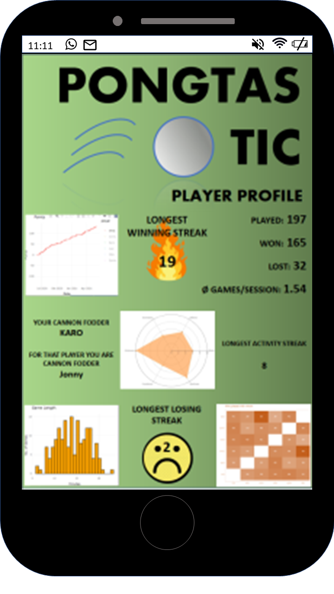

```{r setup, include=FALSE}
knitr::opts_chunk$set(echo = TRUE)
library(data.table)
library(ggplot2)
library(reshape2)
library(plyr)
library(plotly)

```

### Team MarHack: Jonny, Quirin, Chris, Luis, Karo

## The Idea
```{r idea, echo=FALSE, out.width = '25%'}

```

## Data Example

```{r data}
#read data
simulated_data <- data.table(read.csv(file = "./../Data/game_simulation_data.csv"))
simulated_data[1:5,]
```

```{r data2}
#read data
dt <- simulated_data

```

## Player statistics

```{r player_profile1, include=FALSE}
players = c("Luis", "Karo", "Jonny", "Chris", "Quirin", "Otto")
player_stat <- data.table()

#number of wins and losses
for(i in 1:6){
  games_won <- nrow(simulated_data[(player1_id==players[i] & player1==21) | (player2_id==players[i] & player2==21)])
  games_lost <- nrow(simulated_data[(player1_id==players[i] & player2==21) | (player2_id==players[i] & player1==21)])
  new_entry <- data.table(player=players[i], 
                                    games_won=games_won, 
                                    games_lost=games_lost)
  player_stat <- rbind(player_stat, new_entry)
}
```

```{r player_profile2, include=FALSE}
#mean duration of one game
mean_duration <- data.table()
for (i in 1:length(players)) {
  time_stamps <- simulated_data[(player1==21 | player2==21) & (player1_id==players[i] | player2_id==players[i])]
  mean_tmp <- round((sum(time_stamps[,3])/nrow(time_stamps))/60, digits = 2)
  mean_duration <- rbind(mean_duration, mean_tmp)
}
player_stat <- cbind(player_stat, mean_duration = mean_duration)
names(player_stat)[4] <- "mean_duration"
```

```{r player_profile3, include=FALSE}
#mean number of games per session day
games_per_day <- data.table()
for (i in 1:length(players)) {
  date_data <- simulated_data[(player1==21 | player2==21) & (player1_id==players[i] | player2_id==players[i]), 
                  games_per_date:=.N, by = game_date][games_per_date!="NA"]
  games_per_day <- rbind(games_per_day, mean(date_data[,games_per_date]))
}
player_stat <- cbind(player_stat, games_per_day = games_per_day)
names(player_stat)[5] <- "games_per_day"
```

```{r player_profile4}
player_stat
```

## Player Plots
```{r plot1, echo=FALSE}
win_loose_melt <- melt(data = player_stat[,c(1:3)], id.vars = 'player')
data_sorted <- arrange(win_loose_melt, desc(variable), player) 
data_cumsum <- ddply(data_sorted, "player", transform, label_ypos=cumsum(value))
ggplot(data_cumsum, aes(x = player, y = value, fill = variable)) + 
  geom_bar(stat = 'identity', width = 0.6) + 
  geom_text(aes(y = label_ypos, label = value), vjust = 1.6, color = 'white', size = 3.5) +
  scale_fill_manual(values=c('#66CC99','#CC6666')) +
  guides(fill=guide_legend(title=NULL)) +
  labs(title = "Plot of won and lost games", x = "Player", y = "Number of Games") + 
  theme_minimal()
```

```{r love_matrix, include=FALSE}
result <- c()
for (i in 1:length(players)) {
  for (j in 1:length(players)) {
    new_result <- nrow(simulated_data[(player1==21 | player2==21) & ((player1_id==players[i] & player2_id==players[j]) | (player2_id==players[i] & player1_id==players[j]))])
    result <- append(result, new_result)
  }
}
love_matrix <- matrix(result, byrow = TRUE, nrow = length(players))
colnames(love_matrix) <- players
rownames(love_matrix) <- players
```

```{r love_plot, echo=FALSE}
love_melt <- melt(love_matrix)
names(love_melt) <- c("Player_1", "Player_2", "Amount")
love_plot <- ggplot(love_melt, aes(x = Player_1, y = Player_2)) +
  geom_raster(aes(fill = Amount)) +
  geom_text(aes(label = Amount), color = "white") +
  scale_fill_gradient(low="white", high="#660000") +
  labs(x="", y="", title="Who played with whom") +
  theme_bw()
ggplotly(love_plot)
```

```{r game_lengths, echo=FALSE}
dt$game_date <- as.Date(dt[,game_date])
dt[,winner := ifelse(max(player1)==21, player1_id, player2_id), by = game_id]

chosen_player = c("Luis", "Karo", "Jonny", "Chris", "Quirin", "Otto")[4]
chosen_player2 = c("Luis", "Karo", "Jonny", "Chris", "Quirin", "Otto")[1]

# Q1: how fast do you win games: ----

# extract all games in which you played
chosen_player_dt <- dt[player1_id == chosen_player | player2_id == chosen_player]

# further extract the games you won
winnings <- chosen_player_dt[(player1>=21 & player1_id == chosen_player) | (player2>=21 & player2_id == chosen_player)]

# the game length of won games is just the 'final' time_stamp_value.
# plot the game lenghts as a histogram 
gg_game_lenghts <- ggplot(melt(winnings,
                               measure.vars = 'time_stamp',
                               id.vars = 'game_id')) +
  geom_histogram(aes(value/60),
                 bins = 25,
                 fill='orange',
                 color='black') + 
  ggtitle('Game Length') +
  theme_minimal() +
  xlab("Minutes") +
  ylab("No. of Games")

ggplotly(gg_game_lenghts)
```

```{r walk_plot, echo=FALSE}
endscores <- chosen_player_dt[(player1>=21) | (player2>=21)]

current_win_streak <- 0
current_losing_streak <- 0
winning_streak_vec <- c()
losing_streak_vec <- c()

for(i in 1:nrow(endscores)){
  if(
    (endscores$player1_id[i] == chosen_player && endscores$player1[i]==21) |
    (endscores$player2_id[i] == chosen_player && endscores$player2[i]==21)
    ){
    current_win_streak = current_win_streak+1
  }
  else{
    winning_streak_vec <- c(winning_streak_vec, current_win_streak)
    current_win_streak = 0
  }
  
  if(
    (endscores$player1_id[i] == chosen_player && endscores$player2[i]==21) |
    (endscores$player2_id[i] == chosen_player && endscores$player1[i]==21)
    ){
    current_losing_streak = current_losing_streak+1
  }
  else{
    losing_streak_vec <- c(losing_streak_vec, current_losing_streak)
    current_losing_streak = 0
  }
}

# the consecutive winning/losing stats:
max_winning_streak <- max(winning_streak_vec)
mean_winning_streak <- mean(winning_streak_vec)
max_losing_streak <- max(losing_streak_vec)

# this could be implemented as ELO.
player_score_walk <- endscores[order(game_date), .(game_date,
                      score=ifelse(winner==chosen_player,1,-1))][,.(game_date,
                                                                    score = cumsum(score))]

gg_points <-ggplot(player_score_walk, aes(x=game_date, y=score)) +
  # geom_vline(xintercept = 0, size=0.7, alpha=0.5, color='orange') + 
  geom_point(size=1,alpha=0.4, shape=1) +
  theme_minimal() +
  xlab("Date") + 
  ylab("Points") +
  ylim(-max(player_score_walk$score), max(player_score_walk$score)) + 
  ggtitle("Points")
fig <- ggplotly(gg_points)
fig <- fig %>% layout(hovermode = "x unified")
fig
```

```{r spider_plot, include = FALSE}

# spielgewinner identifizieren

dt[,winner := ifelse(max(player1)==21, player1_id, player2_id), by = game_id]

## ausgespielte gesamtpunktzahl // knappheit der siege
#dt[, sum(winner==chosen_player),by = game_id][,mean(V1)/21*10]

# punktratio for chosen player.

endscores[,winner := ifelse(max(player1)==21, player1_id, player2_id), by = game_id]
endscores[, ratio:= ifelse((player1_id==chosen_player) & (winner == chosen_player), player1/player2, player2/player1)]


# on-serve-strengh
on_serve_strengh <- chosen_player_dt[chosen_player==player1_id & who_serves==1, sum(who_serves==who_scores)/sum(who_serves),by=game_id] %>% rbind(
                      chosen_player_dt[chosen_player==player2_id & who_serves==2, sum(who_serves==who_scores)/sum(who_serves-1),by=game_id]) # who_serves-1 because who_serves is 2 and we are looking for the ratio.
setnames(on_serve_strengh,old = "V1", new = "serve_points_ratio")

# on-defense-strengh
on_defense_strengh <- chosen_player_dt[chosen_player==player1_id & who_serves==2, sum(who_serves!=who_scores)/sum(who_serves-1),by=game_id] %>% rbind(
                        chosen_player_dt[chosen_player==player2_id & who_serves==1, sum(who_serves!=who_scores)/sum(who_serves),by=game_id]) # who_serves-1 because who_serves is 2 and we are looking for the ratio.
setnames(on_defense_strengh,old = "V1", new = "def_points_ratio")

endscores <- endscores[on_serve_strengh,on='game_id']
endscores <- endscores[on_defense_strengh,on='game_id']


## spiderplot 
player_profile <- endscores[,.(Attack=median(serve_points_ratio)*10,
                               Defense=median(def_points_ratio)*10,
                               Domination=median(ratio)*3,
                               Endurance=(median(time_stamp)/60)-5
                               )] %>% cbind(Consistency=mean_winning_streak) %>% 
                                      cbind(Quickness = 34-chosen_player_dt[,median(time_to_score)])

## spieler2 ----
# Q1: how fast do you win games: ----

# extract all games in which you played
chosen_player_dt <- dt[player1_id == chosen_player2 | player2_id == chosen_player2]

# further extract the games you won
winnings <- chosen_player_dt[(player1>=21 & player1_id == chosen_player2) | (player2>=21 & player2_id == chosen_player2)]

# the game length of won games is just the 'final' time_stamp_value.
# plot the game lenghts as a histogram 
gg_game_lenghts <- ggplot(melt(winnings,
                               measure.vars = 'time_stamp',
                               id.vars = 'game_id')) +
  geom_histogram(aes(value/60),
                 bins = 25,
                 fill='orange',
                 color='black') + 
  ggtitle('Game Length') +
  theme_minimal() +
  xlab("Minutes") +
  ylab("No. of Games")

ggplotly(gg_game_lenghts)


## Q2: how long are your game winning/losing streaks

# extract your game-end-results
endscores <- chosen_player_dt[(player1>=21) | (player2>=21)]

current_win_streak <- 0
current_losing_streak <- 0
winning_streak_vec <- c()
losing_streak_vec <- c()

for(i in 1:nrow(endscores)){
  if(
    (endscores$player1_id[i] == chosen_player2 && endscores$player1[i]==21) |
    (endscores$player2_id[i] == chosen_player2 && endscores$player2[i]==21)
  ){
    current_win_streak = current_win_streak+1
  }
  else{
    winning_streak_vec <- c(winning_streak_vec, current_win_streak)
    current_win_streak = 0
  }
  if(
    (endscores$player1_id[i] == chosen_player2 && endscores$player2[i]==21) |
    (endscores$player2_id[i] == chosen_player2 && endscores$player1[i]==21)
  ){
    current_losing_streak = current_losing_streak+1
  }
  else{
    losing_streak_vec <- c(losing_streak_vec, current_losing_streak)
    current_losing_streak = 0
  }
}

# the consecutive winning/losing stats:
max_winning_streak <- max(winning_streak_vec)
mean_winning_streak <- mean(winning_streak_vec)
max_losing_streak <- max(losing_streak_vec)


# concentration/spielfluss (wie lang von punkt zu punkt)
chosen_player_dt[, time_to_score]

# spielgewinner identifizieren

dt[,winner := ifelse(max(player1)==21, player1_id, player2_id), by = game_id]

## ausgespielte gesamtpunktzahl // knappheit der siege
dt[, sum(winner==chosen_player2),by = game_id]

# punktratio for chosen player.

endscores[,winner := ifelse(max(player1)==21, player1_id, player2_id), by = game_id]
endscores[, ratio:= ifelse((player1_id==chosen_player2) & (winner == chosen_player2), player1/player2, player2/player1)]


# on-serve-strengh
on_serve_strengh <- chosen_player_dt[chosen_player2==player1_id & who_serves==1, sum(who_serves==who_scores)/sum(who_serves),by=game_id] %>% rbind(
  chosen_player_dt[chosen_player2==player2_id & who_serves==2, sum(who_serves==who_scores)/sum(who_serves-1),by=game_id]) # who_serves-1 because who_serves is 2 and we are looking for the ratio.
on_serve_strengh[order(game_id),]
setnames(on_serve_strengh,old = "V1", new = "serve_points_ratio")

# on-defense-strengh
on_defense_strengh <- chosen_player_dt[chosen_player2==player1_id & who_serves==2, sum(who_serves!=who_scores)/sum(who_serves-1),by=game_id] %>% rbind(
  chosen_player_dt[chosen_player2==player2_id & who_serves==1, sum(who_serves!=who_scores)/sum(who_serves),by=game_id]) # who_serves-1 because who_serves is 2 and we are looking for the ratio.
on_defense_strengh[order(game_id),]
setnames(on_defense_strengh,old = "V1", new = "def_points_ratio")

endscores <- endscores[on_serve_strengh,on='game_id']
endscores <- endscores[on_defense_strengh,on='game_id']


## spiderplot 
player_profile2 <- endscores[,.(Attack=median(serve_points_ratio)*10,
                               Defense=median(def_points_ratio)*10,
                               Domination=median(ratio),
                               Endurance=(median(time_stamp)/60)-5
)] %>% cbind(Consistency=mean_winning_streak) %>% 
  cbind(Quickness = 34-chosen_player_dt[,median(time_to_score)])


fig <- plot_ly(
  type = 'scatterpolar',
  fill = 'toself'
) 
fig <- fig %>% 
  add_trace(
    r = t(c(t(c(player_profile)), t(c((player_profile[,1]))))),
    theta = c('Attack',
              'Defense',
              'Domination',
              'Endurance',
              'Consistency',
              'Quickness',
              'Attack'),
    name = chosen_player
  )
fig <- fig %>%
  add_trace(
    r = t(c(t(c(player_profile2)), t(c((player_profile2[,1]))))),
    theta = c('Attack',
              'Defense',
              'Domination',
              'Endurance',
              'Consistency',
              'Quickness',
              'Attack'),
    name = chosen_player2
  )
fig <- fig %>%
  layout(
    polar = list(
      radialaxis = list(
        visible = T,
        range = c(0,10)
      )
    ),
    showlegend = F
  )

fig
## time series


```

```{r spider_plot2, echo = FALSE}
fig
```
